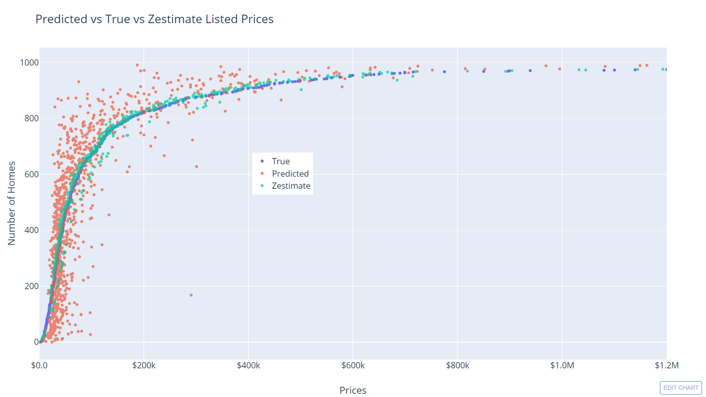
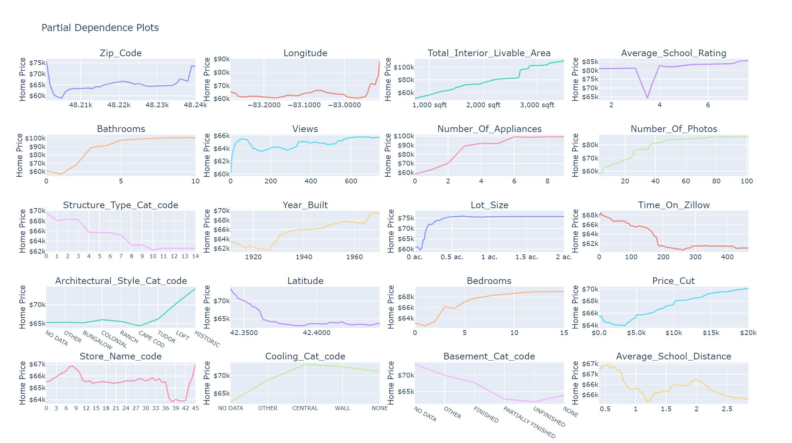

    <h1> Imperial College MSc. Finance 2019 Applied Project </h1>

## Exploratory Data Analysis of Home Price Variation

> The purpose of this study was to take an analytical approach to analysing residential home
prices in the city of Detroit, Michigan USA and to identify features that attributed to the
largest explained variance in price and highest feature importance based on a random forest
regression model. The overarching objective was to build a scalable tool and data set using
a combination of new technology and data to uncover insights that any type of investor or
general consumer could use to make an informed real estate investment decision.

### Project Breakdown

    1. Web Crawler
    2. Data Aggregation & Cleaning
    3. Random Forest Modeling
    4. Data Visualization
#### Web Crawler
> The web scraper was designed to be used in one of two ways. The first method utilises
Selenium, a web browser automation package, that allows the crawler to scrape the
Zillow website according to the given post code arguments. The second method utilises
Beautiful Soup to parse locally saved Zillow listing HTML files in a given directory tree.
The advantages to the first method is that it is fully automated, but the program is slow
and is prone to being stopped by Google ReCaptcha's, which Selenium can not handle. The
advantages to the second method using Beautiful Soup, is that the HTML parsing is much
faster and there are no Google ReCaptcha issues, but the HTML files must be saved down.
Some HTML data is not available in this method because the background JavaScript can
not be run with Beautiful Soup.

#### Data Cleaning
> The Data Aggregation.py program was built to parse the layers of each post code's hash map
and to concatenate each home listing as a pandas data frame row. While the hash maps are
being parsed, there are multiple data cleaning and feature calculation steps. An example of
these steps is get SchoolData function which parses the school ratings, and distance strings
using regular expressions to then calculate an average distance and rating score for that
particular home listing. Data from Google Map's Places API is then added by calling the
API for the nearest store within 800 metres of the house listing GPS coordinates. The
nearest store name and average price listing provided by google are then mapped back to
the base data set.

#### Random Forest Modeling
> Model preprocessing included the dropping of object type columns and taking the log trans-
formation of home prices to help prediction accuracy, cited from examples on Kaggle (14).
The 3,304 listings were then split into training and testing data sets at a randomly seeded
70% training, 30% testing ratio. Initially several models were trained and cross validated
(10 folds) through a range of 2 to 120 estimators (number of trees used in the random forest)
to obtain averaged explained variance scores at each estimator level.
After seeing extremely high explained variance scores in the range of 98% with models
containing less than 50 trees and feature importance values in the range of 20% to 30%
for Tax Assessed Value, Annual Tax Amount, Calculated Price Sqft and Price sqft, these
features were dropped from the model since they were too similar to the true price values.
The remaining data was then re-run to obtain base values on the new data, and then
run through a randomised grid search function (7) to find the best model parameters. The
randomised grid search function randomly iterates across the random forest regression argu-
ments while also cross validating the model at a specified fold integer value. The data set
was then trimmed again by selecting the top 20 features based on their estimated mutual
information between each feature and the associated home price (8).
The trimmed data set is then run through a random forest regression model tuned to the
best parameters provided by the randomised grid search function. This becomes the final
model and prediction values, which are then charted and benchmarked to the true prices and
Zestimate values. The partial dependence plots for each feature against price and the sorted
feature importance values are charted in Plotly (2) to dynamically visualise the results.

#### Data Visualization

> Random forest model predictions against True and Zestimate home prices. 
*The Zestimate price is indeed more accurate but was only able to produce estimated prices for 52% of the observed homes, showing that the Zestimate is a Quality vs. Quantity approach unlike the random forest modeling* 

> The partial dependence plots show the relationship of home prices to the indepent variables shown

